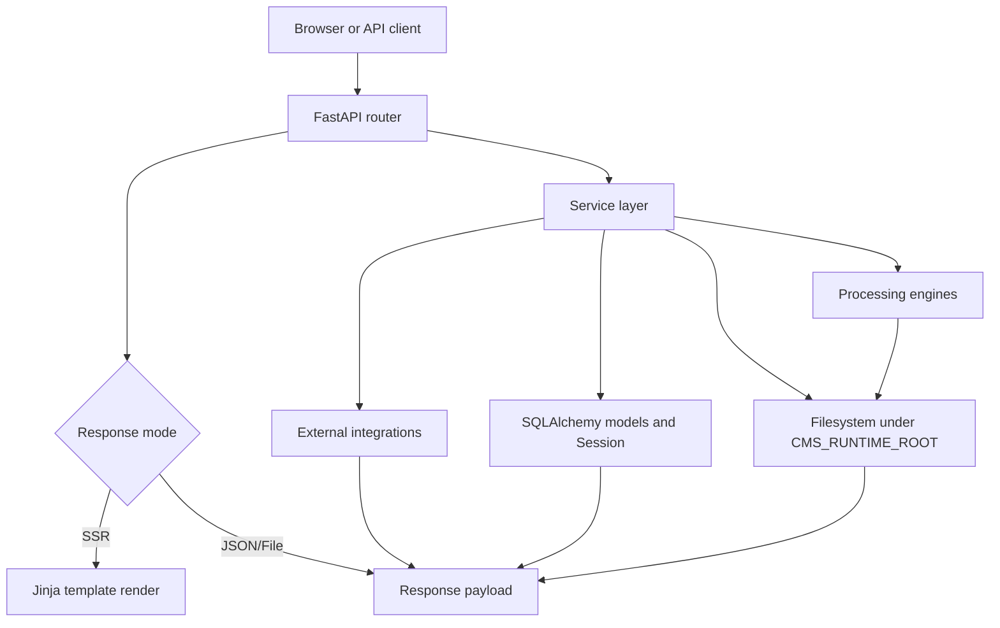
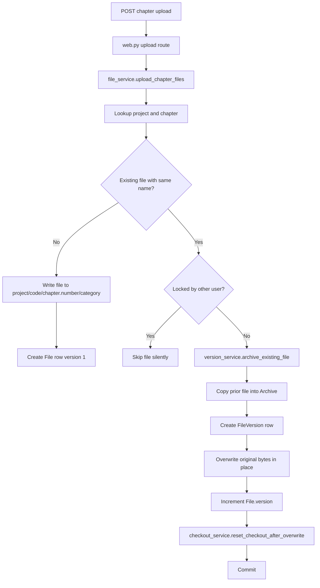
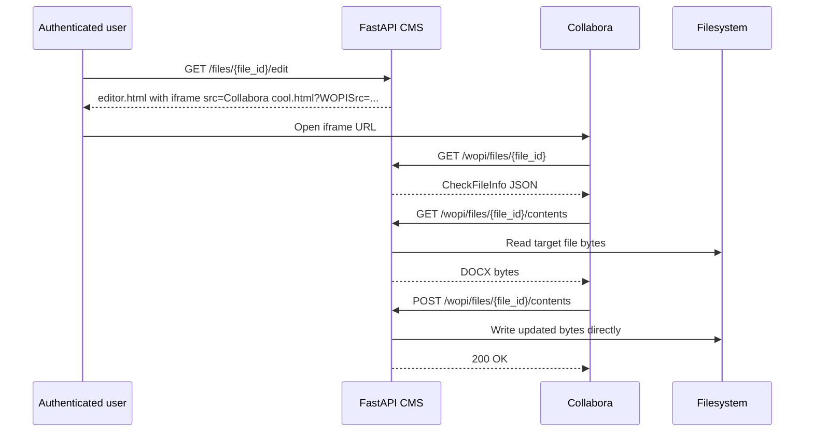

# Backend Flow Diagrams

Related docs:

- [Backend Architecture](architecture/backend_architecture.md)
- [File Workflow](architecture/file_workflow.md)
- [Processing Pipeline](architecture/processing_pipeline.md)
- [Structuring Workflow](architecture/structuring_workflow.md)
- [WOPI Integration](architecture/wopi_integration.md)

## Request Lifecycle



## File Upload Workflow



## Processing Pipeline

```mermaid
flowchart TD
    A[POST /api/v1/processing/files/{id}/process/{type}] --> B[processing.py]
    B --> C[processing_service.start_process]
    C --> D[Auth and role permission check]
    D --> E[Lookup File and disk path]
    E --> F[Lock file for current user]
    F --> G[Create Archive backup and FileVersion row]
    G --> H[Schedule BackgroundTasks callback]
    H --> I[background_processing_task]
    I --> J{Select engine by process_type}
    J --> K[Run engine and gather generated paths]
    K --> L[Register each output as a new File row]
    L --> M[Unlock source file on success]
    J --> N[On exception]
    N --> O[Unlock source file on failure]
```

## Structuring Workflow

```mermaid
flowchart TD
    A[User starts structuring from chapter detail] --> B[Processing route]
    B --> C[StructuringEngine]
    C --> D[Create originalname_Processed.docx]
    D --> E[Register processed File row]
    E --> F[Client polls structuring_status]
    F --> G[processing_service.get_structuring_status]
    G --> H{Processed File row exists?}
    H -->|No| I[Return status processing]
    H -->|Yes| J[Return status completed and new_file_id]
    J --> K[GET /api/v1/files/{id}/structuring/review]
    K --> L[structuring_review_service.build_review_page_state]
    L --> M[Render structuring_review.html with Collabora URL]
    M --> N[Save uses update_document_structure on processed file]
    M --> O[Export returns processed DOCX]
```

## WOPI Interaction


